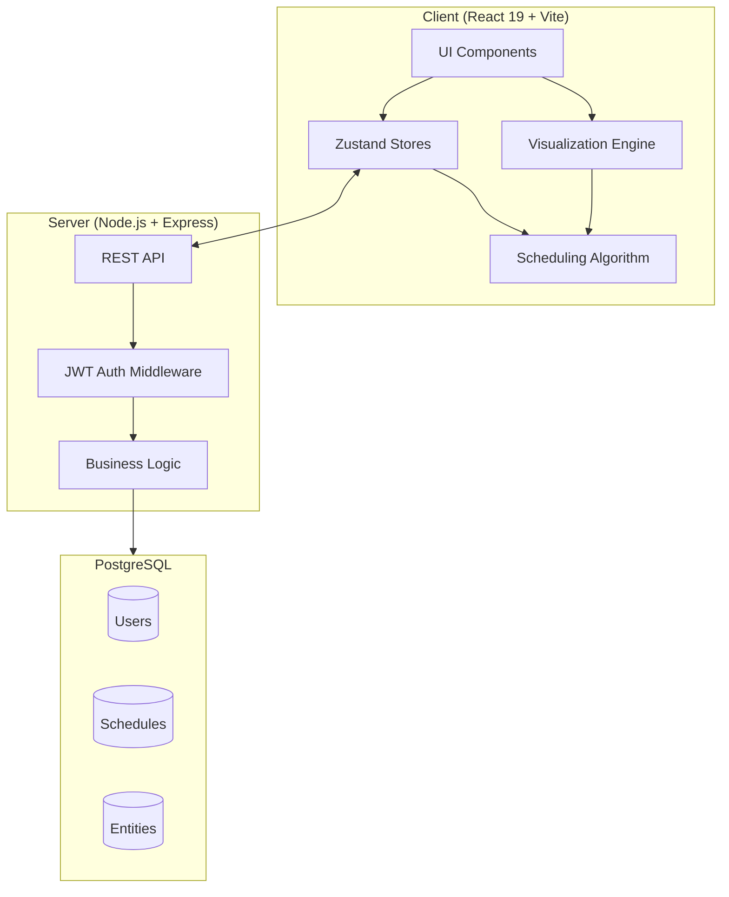

# Technical Design Document: Education Management Modernization

## Overview

This design document outlines the technical architecture for modernizing the
Education Management application — a University Schedule Management System that
solves constraint satisfaction problems to automatically generate class
schedules.

### Project Context

The existing application is a 2022 Code Academy final project built with Create
React App, legacy Redux, and mixed UI libraries (MUI v4/v5, Radium,
styled-components). The modernization transforms this into a production-ready
portfolio piece demonstrating:

- Modern frontend architecture (Vite, TypeScript, Zustand)
- Algorithm visualization with step-by-step playback
- Fullstack capabilities with JWT authentication and PostgreSQL persistence
- Professional UX with drag-and-drop editing and comprehensive error handling

### Key Design Decisions

| Decision         | Choice                           | Rationale                                                                   |
| ---------------- | -------------------------------- | --------------------------------------------------------------------------- |
| Build Tool       | Vite                             | Sub-second HMR, native ESM, maintained ecosystem                            |
| State Management | Zustand                          | Simpler API than Redux Toolkit, built-in TypeScript support, no boilerplate |
| UI Framework     | Tailwind CSS + shadcn/ui         | Utility-first approach, accessible components, no conflicting dependencies  |
| Backend          | Node.js + Express + PostgreSQL   | Familiar JavaScript stack, mature ORM options (Prisma)                      |
| Testing          | Vitest + Playwright + fast-check | Unified tooling with Vite, property-based testing for algorithm correctness |

### Scope

The modernization covers:

1. **Infrastructure**: Vite migration, TypeScript strict mode, dependency
   cleanup
2. **State Layer**: Zustand stores with typed actions and selectors
3. **Algorithm Core**: Enhanced scheduling with backtracking, visualization
   hooks
4. **Backend**: RESTful API with JWT auth and PostgreSQL persistence
5. **UI/UX**: Accessible components, drag-and-drop editing, responsive design

---

## Architecture

### High-Level Architecture



### Layered Architecture

The application follows a clean layered architecture:

```
┌─────────────────────────────────────────────────────────────┐
│                    Presentation Layer                        │
│  Components, Pages, Hooks, Visualization                     │
├─────────────────────────────────────────────────────────────┤
│                    State Management Layer                    │
│  Zustand Stores, Selectors, Actions                          │
├─────────────────────────────────────────────────────────────┤
│                    Business Logic Layer                      │
│  Scheduling Algorithm, Validation, Transformations           │
├─────────────────────────────────────────────────────────────┤
│                    Data Access Layer                         │
│  API Client, Request/Response Types, Error Handling          │
├─────────────────────────────────────────────────────────────┤
│                    API Layer (Backend)                       │
│  Express Routes, Controllers, Middleware                     │
├─────────────────────────────────────────────────────────────┤
│                    Persistence Layer                         │
│  Prisma ORM, PostgreSQL, Migrations                          │
└─────────────────────────────────────────────────────────────┘
```

### Directory Structure

```
education-management/
├── src/
│   ├── components/           # Reusable UI components
│   │   ├── ui/              # shadcn/ui base components
│   │   ├── timetable/       # Timetable display components
│   │   ├── visualization/   # Algorithm visualization components
│   │   └── forms/           # Entity management forms
│   ├── pages/               # Route-level page components
│   ├── stores/              # Zustand state stores
│   ├── lib/                 # Core business logic
│   │   ├── algorithm/       # Scheduling algorithm
│   │   ├── validation/      # Input validation
│   │   └── api/             # API client
│   ├── types/               # TypeScript type definitions
│   ├── hooks/               # Custom React hooks
│   └── utils/               # Utility functions
├── server/
│   ├── routes/              # Express route handlers
│   ├── middleware/          # Auth, error handling middleware
│   ├── services/            # Business logic services
│   └── prisma/              # Database schema and migrations
├── tests/
│   ├── unit/                # Unit tests (Vitest)
│   ├── integration/         # API integration tests
│   ├── e2e/                 # End-to-end tests (Playwright)
│   └── properties/          # Property-based tests (fast-check)
└── public/                  # Static assets
```

---

## Components and Interfaces

### Core Zustand Stores

#### ScheduleStore

Manages the central schedule state including all timetables.

```typescript
interface ScheduleStore {
	// State
	rooms: Record<RoomId, RoomWithTimetable>
	lecturers: Record<LecturerId, LecturerWithTimetable>
	faculties: Record<FacultyId, FacultyWithTimetable>
	scheduleMetadata: ScheduleMetadata

	// Actions
	assignClass: (assignment: ClassAssignment) => AssignmentResult
	unassignClass: (slotRef: TimeSlotRef) => void
	moveClass: (from: TimeSlotRef, to: TimeSlotRef) => MoveResult
	resetSchedule: () => void
	loadSchedule: (scheduleId: string) => Promise<void>
	saveSchedule: (name: string) => Promise<string>

	// Selectors
	getRoomTimetable: (roomId: RoomId) => Timetable
	getLecturerTimetable: (lecturerId: LecturerId) => Timetable
	getFacultyTimetable: (facultyId: FacultyId) => Timetable
	getConflicts: () => Conflict[]
	getUtilizationStats: () => UtilizationStats
}
```

#### VisualizationStore

Manages algorithm visualization playback state.

```typescript
interface VisualizationStore {
	// State
	steps: AlgorithmStep[]
	currentStepIndex: number
	playbackState: 'idle' | 'playing' | 'paused' | 'complete'
	playbackSpeed: number // 0.5x, 1x, 2x, 4x
	highlightedElements: HighlightedElement[]
	decisionLog: DecisionLogEntry[]

	// Actions
	startVisualization: (input: ScheduleInput) => void
	play: () => void
	pause: () => void
	stepForward: () => void
	stepBackward: () => void
	setSpeed: (speed: number) => void
	jumpToStep: (index: number) => void
	reset: () => void
}
```

#### AuthStore

Manages authentication state and tokens.

```typescript
interface AuthStore {
	// State
	user: User | null
	isAuthenticated: boolean
	isLoading: boolean

	// Actions
	login: (credentials: LoginCredentials) => Promise<LoginResult>
	logout: () => Promise<void>
	refreshToken: () => Promise<boolean>
	checkAuth: () => Promise<void>
}
```

#### EntityStore

Manages CRUD operations for lecturers, rooms, and faculties.

```typescript
interface EntityStore {
	// State
	lecturers: Lecturer[]
	rooms: Room[]
	faculties: Faculty[]
	isLoading: boolean
	error: string | null

	// Lecturer Actions
	addLecturer: (lecturer: CreateLecturerInput) => Promise<Lecturer>
	updateLecturer: (
		id: LecturerId,
		updates: UpdateLecturerInput
	) => Promise<Lecturer>
	deleteLecturer: (id: LecturerId) => Promise<void>

	// Room Actions
	addRoom: (room: CreateRoomInput) => Promise<Room>
	updateRoom: (id: RoomId, updates: UpdateRoomInput) => Promise<Room>
	deleteRoom: (id: RoomId) => Promise<void>

	// Faculty Actions
	addFaculty: (faculty: CreateFacultyInput) => Promise<Faculty>
	updateFaculty: (
		id: FacultyId,
		updates: UpdateFacultyInput
	) => Promise<Faculty>
	deleteFaculty: (id: FacultyId) => Promise<void>
}
```

#### EditHistoryStore

Manages undo/redo for manual schedule edits.

```typescript
interface EditHistoryStore {
	// State
	history: ScheduleEdit[]
	currentIndex: number
	maxHistorySize: 50

	// Actions
	pushEdit: (edit: ScheduleEdit) => void
	undo: () => ScheduleEdit | null
	redo: () => ScheduleEdit | null
	canUndo: () => boolean
	canRedo: () => boolean
	clearHistory: () => void
}
```

### Scheduling Algorithm Interface

```typescript
interface SchedulingAlgorithm {
	/**
	 * Validates input data before scheduling.
	 * Returns validation errors or null if valid.
	 */
	validateInput(input: ScheduleInput): ValidationResult

	/**
	 * Generates a complete schedule using constraint satisfaction.
	 * Yields intermediate steps for visualization.
	 */
	generateSchedule(
		input: ScheduleInput
	): Generator<AlgorithmStep, ScheduleResult>

	/**
	 * Checks if a specific assignment is valid given current state.
	 */
	validateAssignment(
		assignment: ClassAssignment,
		currentState: ScheduleState
	): AssignmentValidation

	/**
	 * Attempts to find a valid schedule using backtracking.
	 * Returns the best partial schedule if no complete solution exists.
	 */
	solveWithBacktracking(
		input: ScheduleInput,
		options: BacktrackingOptions
	): Generator<AlgorithmStep, ScheduleResult>
}
```

### API Client Interface

```typescript
interface ApiClient {
	// Authentication
	auth: {
		login(credentials: LoginCredentials): Promise<AuthResponse>
		logout(): Promise<void>
		refresh(): Promise<AuthResponse>
		register(data: RegisterData): Promise<AuthResponse>
	}

	// Entities
	lecturers: CrudEndpoint<Lecturer, CreateLecturerInput, UpdateLecturerInput>
	rooms: CrudEndpoint<Room, CreateRoomInput, UpdateRoomInput>
	faculties: CrudEndpoint<Faculty, CreateFacultyInput, UpdateFacultyInput>

	// Schedules
	schedules: {
		list(): Promise<ScheduleSummary[]>
		get(id: string): Promise<Schedule>
		create(data: CreateScheduleInput): Promise<Schedule>
		update(id: string, data: UpdateScheduleInput): Promise<Schedule>
		delete(id: string): Promise<void>
	}
}

interface CrudEndpoint<T, CreateInput, UpdateInput> {
	list(params?: ListParams): Promise<PaginatedResponse<T>>
	get(id: string): Promise<T>
	create(data: CreateInput): Promise<T>
	update(id: string, data: UpdateInput): Promise<T>
	delete(id: string): Promise<void>
}
```

### Key React Components

#### TimetableGrid

Displays a 5-day × 4-hour schedule grid with interactive cells.

```typescript
interface TimetableGridProps {
	timetable: Timetable
	viewMode: 'lecturer' | 'room' | 'faculty'
	entityId: string
	onSlotClick?: (slot: TimeSlot) => void
	onSlotDrop?: (from: TimeSlotRef, to: TimeSlotRef) => void
	highlightedSlots?: TimeSlot[]
	conflictSlots?: TimeSlot[]
	isEditable?: boolean
}
```

#### VisualizationPlayer

Controls and displays algorithm visualization playback.

```typescript
interface VisualizationPlayerProps {
	onStart: () => void
	isRunning: boolean
}

// Sub-components
interface PlaybackControlsProps {
	state: PlaybackState
	onPlay: () => void
	onPause: () => void
	onStepForward: () => void
	onStepBackward: () => void
	onSpeedChange: (speed: number) => void
}

interface DecisionLogProps {
	entries: DecisionLogEntry[]
	currentIndex: number
}

interface ProgressIndicatorProps {
	currentStep: number
	totalSteps: number
	assignmentsMade: number
	conflictsEncountered: number
}
```

#### EntityForm

Generic form component for creating/editing entities.

```typescript
interface EntityFormProps<T> {
	mode: 'create' | 'edit'
	initialData?: Partial<T>
	schema: ZodSchema<T>
	onSubmit: (data: T) => Promise<void>
	onCancel: () => void
}
```

---

## Data Models

### Core Domain Types

```typescript
// Identifiers
type LecturerId = string
type RoomId = string
type FacultyId = string
type ScheduleId = string
type UserId = string

// Time representation
type DayOfWeek = 1 | 2 | 3 | 4 | 5 // Monday = 1, Friday = 5
type HourSlot = 1 | 2 | 3 | 4

interface TimeSlot {
	day: DayOfWeek
	hour: HourSlot
}

interface TimeSlotRef extends TimeSlot {
	entityType: 'room' | 'lecturer' | 'faculty'
	entityId: string
}

// Timetable structure
type TimetableDay = Record<HourSlot, ClassAssignment | null>
type Timetable = Record<DayOfWeek, TimetableDay>
```

### Entity Models

```typescript
interface Lecturer {
	id: LecturerId
	name: string
	surname: string
	specialties: string[] // Can teach multiple subjects
	imageUrl?: string
	availability: Timetable // null = available, 'blocked' = unavailable
	createdAt: Date
	updatedAt: Date
}

interface LecturerWithTimetable extends Lecturer {
	timetable: Timetable
}

interface Room {
	id: RoomId
	number: string
	capacity: number
	availability: Timetable
	createdAt: Date
	updatedAt: Date
}

interface RoomWithTimetable extends Room {
	timetable: Timetable
}

interface Student {
	id: string
	name: string
	surname: string
}

interface SyllabusEntry {
	subject: string
	requiredHours: number
}

interface Faculty {
	id: FacultyId
	name: string
	syllabus: SyllabusEntry[]
	students: Student[]
	createdAt: Date
	updatedAt: Date
}

interface FacultyWithTimetable extends Faculty {
	timetable: Timetable
	remainingHours: Record<string, number> // subject -> hours left
}
```

### Schedule Models

```typescript
interface ClassAssignment {
	facultyId: FacultyId
	lecturerId: LecturerId
	roomId: RoomId
	subject: string
	timeSlot: TimeSlot
	isManual: boolean // true if manually placed, false if auto-generated
}

interface ScheduleState {
	rooms: Record<RoomId, RoomWithTimetable>
	lecturers: Record<LecturerId, LecturerWithTimetable>
	faculties: Record<FacultyId, FacultyWithTimetable>
}

interface ScheduleMetadata {
	id: ScheduleId
	name: string
	userId: UserId
	createdAt: Date
	updatedAt: Date
	isComplete: boolean
	stats: ScheduleStats
}

interface ScheduleStats {
	totalAssignments: number
	manualAssignments: number
	roomUtilization: number // 0-100%
	unresolvedConstraints: string[]
}

interface Schedule extends ScheduleMetadata {
	state: ScheduleState
}
```

### Algorithm Models

```typescript
interface ScheduleInput {
	lecturers: Lecturer[]
	rooms: Room[]
	faculties: Faculty[]
}

interface AlgorithmStep {
	stepNumber: number
	type: 'evaluate' | 'assign' | 'conflict' | 'backtrack' | 'complete'
	description: string

	// What's being evaluated
	currentFaculty?: FacultyId
	currentSubject?: string
	currentLecturer?: LecturerId
	currentRoom?: RoomId
	currentSlot?: TimeSlot

	// Constraint check results
	constraintChecks?: ConstraintCheck[]

	// State after this step
	stateSnapshot?: Partial<ScheduleState>
}

interface ConstraintCheck {
	constraint: string
	passed: boolean
	details: string
}

interface ScheduleResult {
	success: boolean
	schedule: ScheduleState
	totalSteps: number
	backtracks: number
	unresolvedConstraints: UnresolvedConstraint[]
}

interface UnresolvedConstraint {
	type: string
	description: string
	affectedEntities: string[]
}

interface BacktrackingOptions {
	maxBacktracks: number
	preferEvenDistribution: boolean
	minimizeRoomWaste: boolean
}
```

### Validation Models

```typescript
interface ValidationResult {
	isValid: boolean
	errors: ValidationError[]
}

interface ValidationError {
	code: string
	message: string
	field?: string
	context?: Record<string, unknown>
}

interface AssignmentValidation {
	isValid: boolean
	violations: ConstraintViolation[]
}

interface ConstraintViolation {
	type:
		| 'lecturer_conflict'
		| 'room_conflict'
		| 'faculty_conflict'
		| 'capacity_exceeded'
	message: string
	conflictingAssignment?: ClassAssignment
}
```

### Edit History Models

```typescript
interface ScheduleEdit {
	id: string
	timestamp: Date
	type: 'assign' | 'unassign' | 'move'
	before: ClassAssignment | null
	after: ClassAssignment | null
}

interface Conflict {
	type: 'double_booking' | 'capacity' | 'specialty_mismatch'
	slots: TimeSlotRef[]
	description: string
}
```

### Authentication Models

```typescript
interface User {
	id: UserId
	email: string
	name: string
	createdAt: Date
}

interface LoginCredentials {
	email: string
	password: string
}

interface AuthResponse {
	user: User
	accessToken: string
	refreshToken: string
}

interface LoginResult {
	success: boolean
	error?: 'invalid_credentials' | 'account_locked' | 'session_expired'
}
```

### API Response Models

```typescript
interface PaginatedResponse<T> {
	data: T[]
	total: number
	page: number
	pageSize: number
	hasMore: boolean
}

interface ApiError {
	code: string
	message: string
	details?: Record<string, unknown>
}

interface ListParams {
	page?: number
	pageSize?: number
	sortBy?: string
	sortOrder?: 'asc' | 'desc'
	search?: string
	filters?: Record<string, unknown>
}
```

### Database Schema (Prisma)

```prisma
model User {
  id           String     @id @default(uuid())
  email        String     @unique
  passwordHash String
  name         String
  createdAt    DateTime   @default(now())
  updatedAt    DateTime   @updatedAt
  schedules    Schedule[]
}

model Lecturer {
  id           String   @id @default(uuid())
  name         String
  surname      String
  specialties  String[]
  imageUrl     String?
  availability Json     // Timetable structure
  createdAt    DateTime @default(now())
  updatedAt    DateTime @updatedAt
}

model Room {
  id           String   @id @default(uuid())
  number       String   @unique
  capacity     Int
  availability Json     // Timetable structure
  createdAt    DateTime @default(now())
  updatedAt    DateTime @updatedAt
}

model Faculty {
  id        String   @id @default(uuid())
  name      String   @unique
  syllabus  Json     // SyllabusEntry[]
  students  Json     // Student[]
  createdAt DateTime @default(now())
  updatedAt DateTime @updatedAt
}

model Schedule {
  id        String   @id @default(uuid())
  name      String
  userId    String
  user      User     @relation(fields: [userId], references: [id])
  state     Json     // ScheduleState
  stats     Json     // ScheduleStats
  createdAt DateTime @default(now())
  updatedAt DateTime @updatedAt

  @@index([userId])
}
```

---

## Correctness Properties

_A property is a characteristic or behavior that should hold true across all
valid executions of a system — essentially, a formal statement about what the
system should do. Properties serve as the bridge between human-readable
specifications and machine-verifiable correctness guarantees._

### Property 1: No Double-Booking of Lecturers

_For any_ valid schedule state and any time slot, at most one class assignment
SHALL reference any given lecturer.

**Validates: Requirements 5.1, 5.2**

### Property 2: No Double-Booking of Rooms

_For any_ valid schedule state and any time slot, at most one class assignment
SHALL reference any given room.

**Validates: Requirements 5.1, 5.2**

### Property 3: No Double-Booking of Faculties

_For any_ valid schedule state and any time slot, at most one class assignment
SHALL reference any given faculty.

**Validates: Requirements 5.1, 5.2**

### Property 4: Room Capacity Satisfaction

_For any_ class assignment in a valid schedule, the assigned room's capacity
SHALL be greater than or equal to the faculty's student count.

**Validates: Requirements 5.4, 10.3**

### Property 5: Lecturer Specialty Match

_For any_ class assignment in a valid schedule, the assigned lecturer's
specialties SHALL contain the subject being taught.

**Validates: Requirements 9.3**

### Property 6: Timetable Consistency

_For any_ class assignment, the assignment SHALL appear in exactly three
timetables: the lecturer's, the room's, and the faculty's timetables at the same
time slot.

**Validates: Requirements 12.5**

### Property 7: Undo/Redo Reversibility

_For any_ sequence of manual edits followed by an equal number of undo
operations, the schedule state SHALL return to its original state.

**Validates: Requirements 12.4**

### Property 8: Assignment Validation Consistency

_For any_ class assignment that passes `validateAssignment`, executing
`assignClass` SHALL succeed without throwing and SHALL result in a valid
schedule state.

**Validates: Requirements 12.2, 12.3**

### Property 9: Required Hours Tracking

_For any_ faculty in a schedule, the sum of assigned hours per subject plus the
remaining hours per subject SHALL equal the original required hours in the
syllabus.

**Validates: Requirements 8.3**

### Property 10: Visualization Step Completeness

_For any_ schedule generation, the visualization step sequence SHALL start with
an 'evaluate' step and end with either a 'complete' or 'backtrack' step for each
assignment attempt.

**Validates: Requirements 4.1, 4.7**

### Property 11: Move Operation Atomicity

_For any_ successful move operation (drag-and-drop), the source slot SHALL be
empty AND the destination slot SHALL contain the moved assignment.

**Validates: Requirements 12.1, 12.5**

### Property 12: Authentication Token Validity

_For any_ authenticated request, if the access token is valid, the request SHALL
succeed; if expired but refresh token is valid, a new access token SHALL be
issued automatically.

**Validates: Requirements 6.2, 6.3**

### Property 13: Entity Deletion Safety

_For any_ faculty with scheduled classes, deletion attempts SHALL fail with an
error indicating classes must be unscheduled first.

**Validates: Requirements 8.6**

### Property 14: Input Validation Completeness

_For any_ invalid input data, `validateInput` SHALL return at least one error
with a specific message identifying the issue.

**Validates: Requirements 5.2**

---

## Error Handling

### Error Categories

| Category       | HTTP Status | User Impact                | Recovery Strategy      |
| -------------- | ----------- | -------------------------- | ---------------------- |
| Validation     | 400         | Form shows inline errors   | User corrects input    |
| Authentication | 401         | Redirect to login          | Re-authenticate        |
| Authorization  | 403         | Error toast                | Contact admin          |
| Not Found      | 404         | Error page                 | Navigate elsewhere     |
| Conflict       | 409         | Constraint violation shown | User resolves conflict |
| Server Error   | 500         | Error page with retry      | Retry or report        |
| Network        | N/A         | Offline indicator          | Queue operations       |

### Client-Side Error Handling

```typescript
// Global error boundary for React
class ErrorBoundary extends React.Component {
  componentDidCatch(error: Error, info: ErrorInfo) {
    logError(error, info);
    this.setState({ hasError: true });
  }

  render() {
    if (this.state.hasError) {
      return <ErrorPage onRetry={() => window.location.reload()} />;
    }
    return this.props.children;
  }
}

// API error handling middleware
const apiErrorHandler = (error: ApiError) => {
  switch (error.code) {
    case 'VALIDATION_ERROR':
      // Return errors for form display
      return { type: 'validation', errors: error.details };

    case 'AUTH_EXPIRED':
      // Attempt token refresh
      return authStore.refreshToken();

    case 'CONFLICT':
      // Show constraint violation
      toast.error(error.message);
      return { type: 'conflict', message: error.message };

    default:
      // Log and show generic error
      logError(error);
      toast.error('Something went wrong. Please try again.');
  }
};
```

### Algorithm Error Handling

```typescript
interface AlgorithmError {
	type: 'invalid_input' | 'no_solution' | 'timeout' | 'internal'
	message: string
	context: {
		unresolvedConstraints?: UnresolvedConstraint[]
		partialSchedule?: ScheduleState
		failedAt?: AlgorithmStep
	}
}

// The algorithm never throws; it returns structured errors
function handleAlgorithmResult(result: ScheduleResult): void {
	if (!result.success) {
		if (result.unresolvedConstraints.length > 0) {
			// Show which constraints couldn't be satisfied
			showConstraintReport(result.unresolvedConstraints)
		}

		// Offer the partial schedule as a starting point
		if (result.schedule) {
			offerPartialSchedule(result.schedule)
		}
	}
}
```

### Offline Support

```typescript
// Network status detection
const useNetworkStatus = () => {
	const [isOnline, setIsOnline] = useState(navigator.onLine)

	useEffect(() => {
		const handleOnline = () => setIsOnline(true)
		const handleOffline = () => setIsOnline(false)

		window.addEventListener('online', handleOnline)
		window.addEventListener('offline', handleOffline)

		return () => {
			window.removeEventListener('online', handleOnline)
			window.removeEventListener('offline', handleOffline)
		}
	}, [])

	return isOnline
}

// Operation queue for offline changes
interface QueuedOperation {
	id: string
	type: 'create' | 'update' | 'delete'
	entity: string
	payload: unknown
	timestamp: Date
}

const operationQueue: QueuedOperation[] = []

// Sync when back online
const syncQueue = async () => {
	for (const op of operationQueue) {
		try {
			await executeOperation(op)
			removeFromQueue(op.id)
		} catch (error) {
			// Mark as failed, user can retry
			markOperationFailed(op.id, error)
		}
	}
}
```

---

## Testing Strategy

### Testing Pyramid

```
                    ╱╲
                   ╱  ╲
                  ╱ E2E╲           5-10 tests
                 ╱──────╲         Critical flows
                ╱        ╲
               ╱Integration╲      20-30 tests
              ╱────────────╲     API + Component
             ╱              ╲
            ╱  Unit + Property ╲  100+ tests
           ╱────────────────────╲ Algorithm, stores
          ╱                      ╲
```

### Unit Tests (Vitest)

**Coverage Target: 90%+ for algorithm and stores**

Focus areas:

- Scheduling algorithm constraint checking
- State store actions and selectors
- Validation logic
- Utility functions

```typescript
// Example unit test for constraint checking
describe('validateAssignment', () => {
	it('should reject when lecturer is already booked', () => {
		const state = createStateWithBookedLecturer('lecturer-1', {
			day: 1,
			hour: 1
		})
		const assignment = createAssignment({
			lecturerId: 'lecturer-1',
			timeSlot: { day: 1, hour: 1 }
		})

		const result = validateAssignment(assignment, state)

		expect(result.isValid).toBe(false)
		expect(result.violations[0].type).toBe('lecturer_conflict')
	})
})
```

### Property-Based Tests (fast-check)

**Minimum 100 iterations per property**

```typescript
// Example property test for no double-booking
import * as fc from 'fast-check'

describe('Scheduling Algorithm Properties', () => {
	// Feature: education-management-modernization, Property 1: No Double-Booking of Lecturers
	it('should never double-book a lecturer', () => {
		fc.assert(
			fc.property(arbitraryScheduleInput(), input => {
				const result = runSchedulingAlgorithm(input)

				for (const slot of allTimeSlots()) {
					const lecturerAssignments = getAssignmentsAtSlot(
						result.schedule,
						slot
					)
					const lecturerIds = lecturerAssignments.map(a => a.lecturerId)

					// Each lecturer ID should appear at most once per slot
					expect(new Set(lecturerIds).size).toBe(lecturerIds.length)
				}
			}),
			{ numRuns: 100 }
		)
	})

	// Feature: education-management-modernization, Property 4: Room Capacity Satisfaction
	it('should always assign rooms with sufficient capacity', () => {
		fc.assert(
			fc.property(arbitraryScheduleInput(), input => {
				const result = runSchedulingAlgorithm(input)

				for (const assignment of allAssignments(result.schedule)) {
					const room = getRoomById(input.rooms, assignment.roomId)
					const faculty = getFacultyById(input.faculties, assignment.facultyId)

					expect(room.capacity).toBeGreaterThanOrEqual(faculty.students.length)
				}
			}),
			{ numRuns: 100 }
		)
	})

	// Feature: education-management-modernization, Property 7: Undo/Redo Reversibility
	it('should restore original state after undo sequence', () => {
		fc.assert(
			fc.property(
				arbitraryInitialState(),
				arbitraryEditSequence(),
				(initialState, edits) => {
					let state = initialState
					const history = createEditHistory()

					// Apply all edits
					for (const edit of edits) {
						state = applyEdit(state, edit)
						history.push(edit)
					}

					// Undo all edits
					for (let i = 0; i < edits.length; i++) {
						const undoneEdit = history.undo()
						state = reverseEdit(state, undoneEdit)
					}

					expect(state).toEqual(initialState)
				}
			),
			{ numRuns: 100 }
		)
	})
})
```

### Integration Tests

**API endpoint coverage + Component integration**

```typescript
// API integration test
describe('POST /api/schedules', () => {
  it('should create a schedule and return it', async () => {
    const user = await createTestUser();
    const token = await loginAndGetToken(user);

    const response = await request(app)
      .post('/api/schedules')
      .set('Authorization', `Bearer ${token}`)
      .send({ name: 'Test Schedule', state: emptyScheduleState() });

    expect(response.status).toBe(201);
    expect(response.body.name).toBe('Test Schedule');
    expect(response.body.userId).toBe(user.id);
  });
});

// Component integration test
describe('TimetableGrid', () => {
  it('should update all related timetables on drag-and-drop', async () => {
    const { getByTestId } = render(<TimetableGrid {...defaultProps} />);

    const sourceSlot = getByTestId('slot-1-1');
    const targetSlot = getByTestId('slot-2-3');

    fireEvent.dragStart(sourceSlot);
    fireEvent.drop(targetSlot);

    // Verify the assignment moved in all views
    expect(scheduleStore.getLecturerTimetable('lecturer-1')[1][1]).toBeNull();
    expect(scheduleStore.getLecturerTimetable('lecturer-1')[2][3]).not.toBeNull();
  });
});
```

### End-to-End Tests (Playwright)

**Critical user flows**

```typescript
// E2E test for complete scheduling flow
test('complete scheduling flow', async ({ page }) => {
	// 1. Login
	await page.goto('/')
	await page.fill('[data-testid="email"]', 'test@example.com')
	await page.fill('[data-testid="password"]', 'Password123')
	await page.click('[data-testid="login-button"]')
	await expect(page).toHaveURL('/home')

	// 2. Create entities
	await page.click('[data-testid="nav-lecturers"]')
	await page.click('[data-testid="add-lecturer"]')
	await page.fill('[data-testid="name"]', 'John')
	await page.fill('[data-testid="surname"]', 'Doe')
	await page.selectOption('[data-testid="specialty"]', 'JavaScript')
	await page.click('[data-testid="save"]')

	// 3. Generate schedule with visualization
	await page.click('[data-testid="nav-schedule"]')
	await page.click('[data-testid="generate-schedule"]')
	await page.click('[data-testid="play-visualization"]')

	// Wait for completion
	await expect(
		page.locator('[data-testid="visualization-complete"]')
	).toBeVisible({ timeout: 30000 })

	// 4. Verify schedule created
	await expect(page.locator('[data-testid="assignment-count"]')).not.toHaveText(
		'0'
	)
})
```

### Test Configuration

```typescript
// vitest.config.ts
export default defineConfig({
	test: {
		globals: true,
		environment: 'jsdom',
		setupFiles: ['./tests/setup.ts'],
		coverage: {
			provider: 'v8',
			reporter: ['text', 'json', 'html'],
			exclude: ['node_modules', 'tests'],
			thresholds: {
				lines: 80,
				functions: 80,
				branches: 70,
				statements: 80
			}
		},
		testTimeout: 10000
	}
})
```

---

## Performance Considerations

### Algorithm Performance

- **Target**: Schedule generation for 100 lecturers, 50 rooms, 20 faculties
  within 5 seconds
- **Approach**:
  - Efficient constraint checking with indexed lookups
  - Early termination when no valid slots available
  - Backtracking with intelligent ordering (most constrained first)

### Frontend Performance

- **Code Splitting**: Route-based lazy loading
- **Virtualization**: Use `@tanstack/react-virtual` for lists > 100 items
- **Memoization**: React.memo for pure components, useMemo for expensive
  computations
- **Image Optimization**: Lazy loading with intersection observer

### API Performance

- **Response Caching**: HTTP cache headers for entity lists
- **Pagination**: All list endpoints support pagination
- **Database Indexing**: Indexes on foreign keys and frequently queried fields

### Lighthouse Targets

| Metric                 | Target |
| ---------------------- | ------ |
| Performance            | ≥ 90   |
| Accessibility          | ≥ 95   |
| Best Practices         | ≥ 90   |
| SEO                    | ≥ 90   |
| First Contentful Paint | < 1.5s |
| Time to Interactive    | < 3s   |
