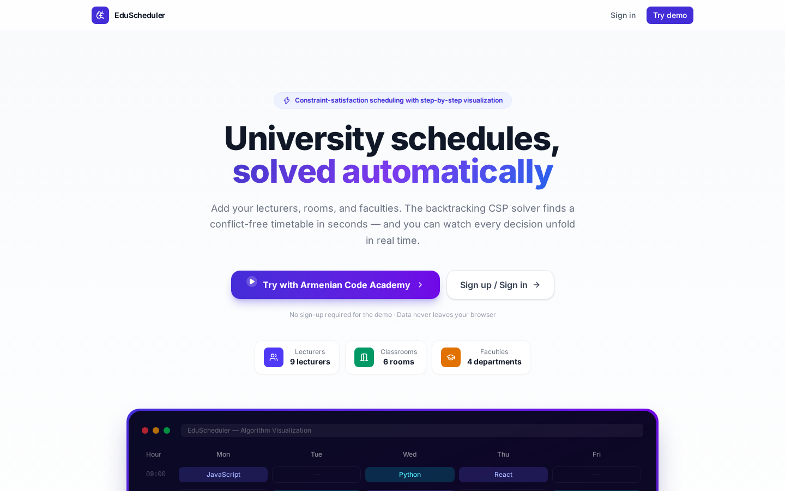
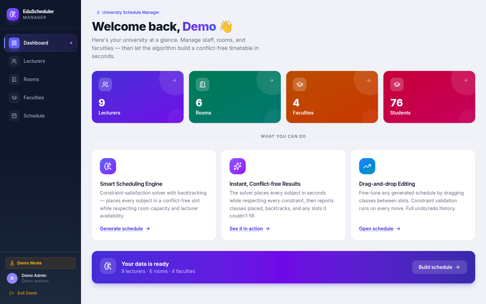
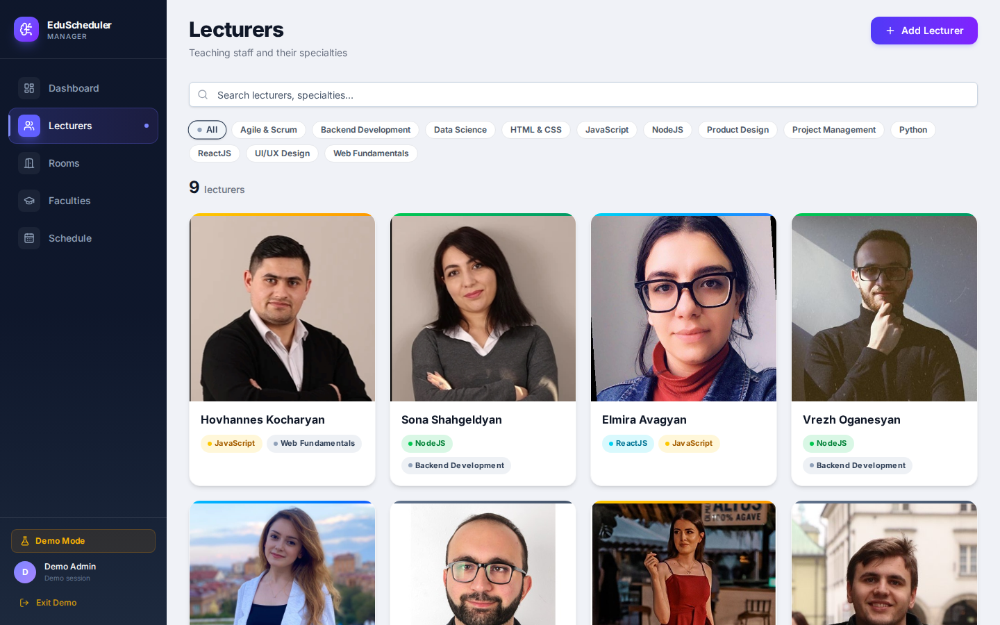
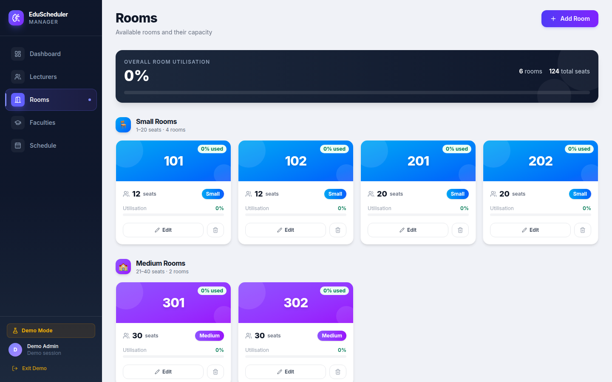
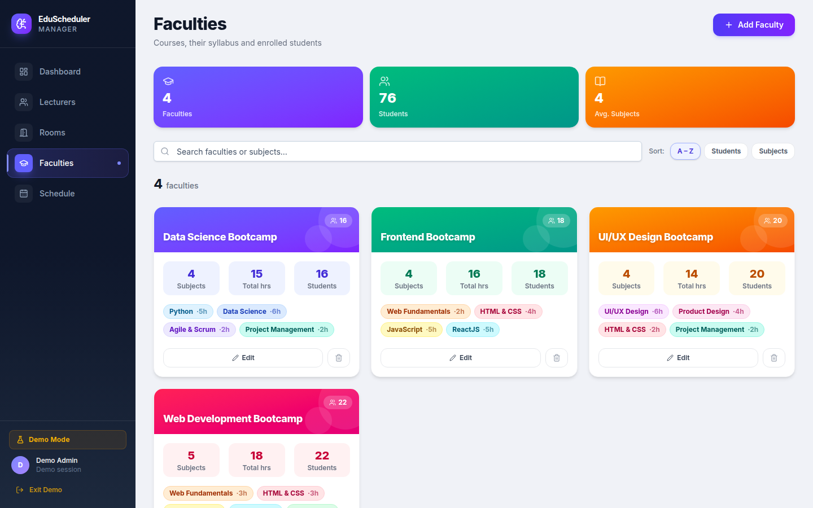
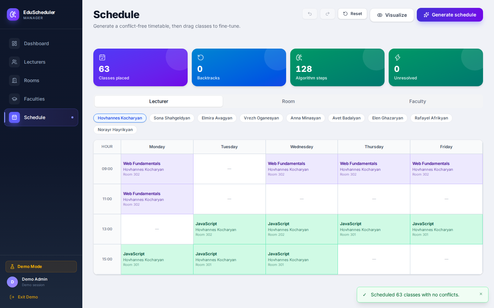
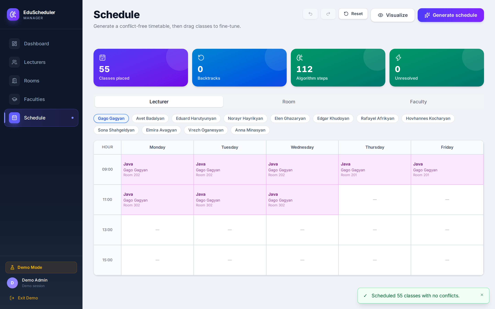

# EduScheduler

> University timetable generator with a backtracking CSP solver and step-by-step algorithm visualization — built as a portfolio project demonstrating full-stack engineering depth.

**[→ Live demo: edu-scheduler-aca.vercel.app](https://edu-scheduler-aca.vercel.app)**

No account required. One click loads the Armenian Code Academy dataset — 9 real instructors, 6 rooms, and 4 bootcamp faculties — then generates a conflict-free schedule in seconds.

---

## What it does

EduScheduler solves the university timetable problem automatically. You define lecturers with their specialties, rooms with capacities, and faculty syllabuses — the engine finds a valid conflict-free schedule that satisfies all constraints simultaneously.

The scheduling engine is a **backtracking constraint-satisfaction algorithm** — the same class of algorithm used in real-world academic scheduling systems. Every decision it makes is recorded and can be replayed step by step in the visualization player.

---

## Screenshots

### Landing page



### Dashboard — university at a glance



### Lecturers — real ACA instructors with their specialties



### Rooms — grouped by capacity with utilization stats



### Faculties — bootcamp syllabuses and enrolled students



### Schedule generation — 63 classes placed, 0 backtracks, 0 unresolved



### Algorithm visualization — step-by-step decision log with live timetable



---

## Key features

### Backtracking CSP solver

The scheduling engine applies a most-constrained-first heuristic — each class to place is ordered by how many lecturers are qualified to teach its subject, so the subjects with the fewest qualified lecturers are scheduled first. It enforces five constraints simultaneously:

- A lecturer can only teach one class at a time
- A room can only host one class at a time
- A faculty group can only attend one class at a time
- Room capacity must accommodate the faculty's student count
- Lecturer specialty must match the subject being taught

For each class the solver searches time slots (spread evenly across days) and the tightest-fitting available room. When a class has no free slot, it undoes the previous assignment and retries; if it still can't be placed, the class is recorded as an unresolved constraint and the solver moves on rather than failing outright. On the Armenian Code Academy dataset (9 lecturers, 6 rooms, 4 bootcamps) the search finds a conflict-free placement for every class on the first pass — zero unresolved constraints and zero backtracks.

### Step-by-step algorithm visualization

The solver is implemented as a JavaScript generator function. Every `yield` produces one `AlgorithmStep` — an evaluate, assign, conflict, or backtrack event. The visualization player consumes these steps and animates them in the timetable grid at adjustable speed (0.5× – 4×). You can pause, step forward, step backward, or jump to any point in the algorithm's execution.

### Drag-and-drop schedule editing

After generation, any class can be dragged to a different time slot. The move is validated atomically against all three timetables (lecturer, room, faculty) before being applied. Constraint violations show as descriptive toast notifications. Every successful move is pushed to the undo/redo history.

### Undo / redo

Full edit history with up to 50 entries. Keyboard shortcuts Ctrl+Z and Ctrl+Y work alongside the toolbar buttons. Undoing a move discards the forward redo branch.

### Two modes

|               | Demo mode                       | Authenticated mode                         |
| ------------- | ------------------------------- | ------------------------------------------ |
| Login         | One click, no account           | Email + password via Supabase              |
| Data          | Armenian Code Academy seed data | Your own university                        |
| Persistence   | In-memory, lost on refresh      | PostgreSQL via Supabase                    |
| Schedule save | No                              | Yes, auto-saved after generation and edits |

---

## Tech stack

| Layer     | Technology                                               |
| --------- | -------------------------------------------------------- |
| Frontend  | React 19, TypeScript, Vite 8, Tailwind CSS 4, shadcn/ui  |
| State     | Redux Toolkit — entity adapters, mode-aware async thunks |
| Auth & DB | Supabase (Auth + PostgreSQL)                             |
| Backend   | Express 4, TypeORM 0.3, Node.js                          |
| Tooling   | ESLint 10, Prettier 3, TypeScript 5.9                    |
| Deploy    | Vercel (frontend + backend as serverless function)       |

---

## Architecture notes

**Scheduling algorithm** lives in `src/lib/algorithm/schedulingAlgorithm.ts` as a pure generator function. It has no React dependencies and can be unit-tested in isolation. The visualization slice consumes its `AlgorithmStep[]` output independently of the schedule slice.

**Mode-aware data layer** — entity thunks in `src/store/entitySlice.ts` check whether the user is in demo mode. In demo mode they dispatch synchronous Redux actions. In authenticated mode they call the REST API and upsert the server response. The UI components dispatch the same thunks regardless of mode.

**Backend** — a single Express app exported from `server/src/app.ts` without calling `listen()`. In production it runs as a Vercel serverless function via `api/index.ts`. Locally it runs as a standard Node server. All entity routes enforce university ownership — a user can only read and modify their own data.

---

## Running locally

### Prerequisites

- Node.js 20+
- A [Supabase](https://supabase.com) project (free tier is sufficient)

### Frontend

```bash
npm install
cp .env.example .env.local
# fill in VITE_SUPABASE_URL and VITE_SUPABASE_ANON_KEY
npm run dev
# → http://localhost:3000
```

Demo mode works fully offline — just open the app and click **Try with Armenian Code Academy**.

### Backend (required for authenticated mode only)

```bash
cd server
npm install
cp .env.example .env
# fill in DATABASE_URL (Supabase session pooler URI)
npm run dev
# → http://localhost:4000
```

Tables are created automatically on first start via TypeORM `synchronize`.

---

## Deployment

The app deploys as a monorepo to Vercel — frontend built by Vite, backend served as a single serverless function.

1. Import the repo at [vercel.com](https://vercel.com)
2. Root directory: `/` — Framework: Vite
3. Set environment variables:

| Variable                 | Description                                            |
| ------------------------ | ------------------------------------------------------ |
| `VITE_SUPABASE_URL`      | Supabase project URL                                   |
| `VITE_SUPABASE_ANON_KEY` | Supabase anon/publishable key                          |
| `VITE_API_URL`           | Backend base URL (leave empty on Vercel — same domain) |
| `SUPABASE_URL`           | Same as above (used by backend)                        |
| `SUPABASE_ANON_KEY`      | Same as above (used by backend)                        |
| `DATABASE_URL`           | Supabase session pooler URI                            |
| `CLIENT_ORIGIN`          | Your Vercel deployment URL                             |

---

## Origin

This project started as a group final project at [Armenian Code Academy](https://bootcamps.aca.am) in 2022 — a basic React + Redux schedule manager.

In 2026 it was fully rebuilt from scratch: migrated from Create React App to Vite 8, added TypeScript strict mode, replaced manual state with RTK entity adapters, implemented the backtracking CSP algorithm with generator-based visualization, added a full backend with Supabase authentication and PostgreSQL persistence, and deployed as a full-stack monorepo on Vercel.

Original project: [RafaelAfrikyan/Education-management](https://github.com/RafaelAfrikyan/Education-management)
